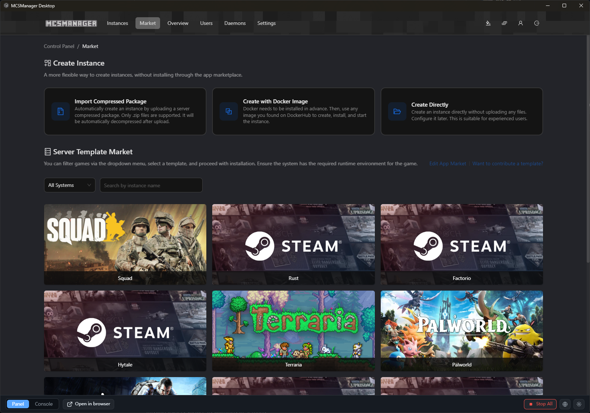
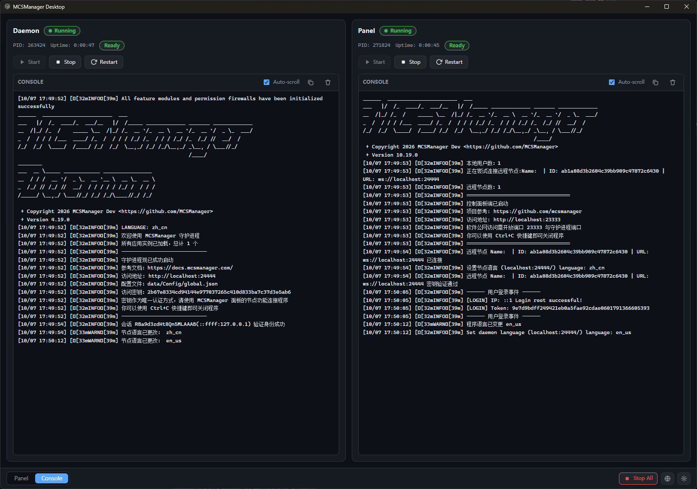

# MCSManager Desktop

[English](README.md) | [简体中文](README.zh-CN.md)




A Windows desktop shell for running [MCSManager](https://github.com/MCSManager/MCSManager) locally.
It starts and stops your MCSManager daemon and panel as child processes, streams their live
console output, and embeds the panel web UI in a tabbed window. Built with Tauri v2 (Rust)
and React 19 + TypeScript.

## Requirements

- Node.js 22 or newer (to install, develop, and to run the managed services)
- Rust toolchain (for `cargo` / Tauri builds; see [Tauri prerequisites](https://tauri.app/start/prerequisites/))
- A **built** MCSManager deployment placed in the fixed service folders next to the app:
  `daemon/` and `web/` (each containing `app.js`, as produced by the MCSManager release
  bundle or `build.bat`)

## Service layout

Service directories are fixed relative to the **run directory** — the folder containing
`mcsmanager-desktop.exe` (in development, the project root):

```
<run directory>/
├── mcsmanager-desktop.exe
├── daemon/        # daemon deployment (node app.js runs here)
└── web/           # panel deployment  (node app.js runs here)
```

This is a portable layout: keep the exe and the two service folders together. Both folders
are validated at startup; missing folders surface as warnings in Settings.

## Configuration

Open Settings in the app, or edit `config.json` directly. The file lives in the app data
directory:

```
%APPDATA%/com.yumao.mcsmanager-desktop/config.json
```

It is created with defaults on first launch; a corrupt file is backed up to `config.json.bak`
and replaced with defaults.

Each service (`daemon` and `panel`) is configured with:

- `script` — the entry file run inside its fixed folder (`app.js` for release builds,
  `production/app.js` for a dev-checkout deployment)
- `extraArgs`, `startDelayMs` (milliseconds to wait before starting the panel), `readyPort`
  (TCP port polled for readiness), `enabled`

Global fields: `nodePath` (Node.js executable), `panelUrl` (URL opened in the Panel tab),
`stopTimeoutMs`, `maxLogLines`, `language`.

## Run

```
npm install
npm run tauri dev     # develop with hot reload
npm run tauri build   # produce a bundled installer
```

Full Windows build & release guide: [`.agents/skills/building-windows-exe/SKILL.md`](.agents/skills/building-windows-exe/SKILL.md).

## Tests

```
npm test              # frontend unit + integration tests (vitest)
npm run test:rust     # backend tests (cargo)
npm run typecheck     # tsc --noEmit
npm run lint          # eslint
npm run format:check  # prettier
```

## Acknowledgements

Thanks to Mimir (https://github.com/parkes-mimir/) for providing Token support to this
project, which greatly accelerated our pace in building the MCSManager ecosystem.
